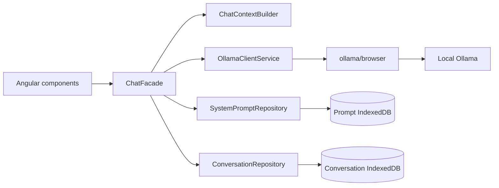

# AGENTS.md

## Purpose

**LocalNook** is the display name and **LocalNook AI** is the extended product name for the `localnook-ai` repository. It is a lightweight Angular client for private, browser-local conversations with models served by a local Ollama instance.

Keep the repository small and credible. Prefer clear contracts, typed boundaries, focused tests, and concise documentation over framework-heavy abstractions.

## Working agreements

- Read the relevant `LAC-*` story under `docs/releases/` before changing behavior.
- Preserve the implemented Release 0.1 capabilities unless a story explicitly changes them.
- Keep Ollama external to this application. Do not install or manage the Ollama runtime from the UI.
- Use the official `ollama/browser` client behind `OllamaClientService`; components must not implement transport or wire parsing.
- Keep UI state in `ChatFacade`, model context construction in `ChatContextBuilder`, and storage behind repositories.
- Conversation history and system prompts persist in brand-independent IndexedDB repositories; the last active model uses a brand-independent localStorage key.
- Browser-local conversation data has an explicit user-controlled permanent deletion path. Preserve it when changing persistence behavior.
- Use `BrandConfig` for product/developer labels. Do not derive storage keys or database names from the display brand.
- Send only intentional model context fields to Ollama. Do not send UI IDs, durations, editing flags, or storage metadata.
- Never persist a partial or aborted assistant stream as a completed message.
- Prefer Angular-native dependency injection and signals. Add a dependency only when it removes real risk or custom code.

## Architecture direction



See `docs/architecture.md`, `docs/ollama-integration.md`, and `docs/storage-and-context.md`.

## Design and branding

- Display name: `LocalNook`.
- Extended product name: `LocalNook AI`.
- Repository name: `localnook-ai`.
- Stable story prefix: `LAC-` (Local AI Client).
- Developer metadata: Keresztes Zsolt — `https://kereszteszsolt.hu`.
- Use semantic Tailwind theme variables for reusable product-level decisions.
- Use Penpot MCP only for relevant visual work, beginning with inspection and small reversible changes.
- Preserve accessibility, keyboard behavior, loading/error states, and responsive layout.

## Repository skills

Use only the skill that matches the task:

- `angular-feature-delivery` — Angular feature, fix, refactor, or dependency work.
- `ollama-integration` — model discovery, streaming, thinking, cancellation, and the official SDK boundary.
- `conversation-context` — context construction and the IndexedDB conversation lifecycle.
- `ui-design` — Penpot-assisted UI work and semantic Tailwind tokens.
- `release-evidence` — release stories, status, acceptance criteria, and verification evidence.

## Custom agents

Use subagents for non-trivial work, not as ceremony:

- `architect` — plans cross-cutting stories and boundary changes.
- `implementation_worker` — owns a bounded implementation after scope is understood.
- `reviewer` — checks correctness, tests, regressions, privacy, and unnecessary complexity.
- `design_reviewer` — checks user-visible changes, tokens, accessibility, and Penpot alignment.

Prefer one write-owning agent at a time. Small documentation or isolated fixes do not require delegation.

## Story and commit approvals

- Before implementing a story, summarize its scope, risks, planned changes, and verification, then obtain explicit user approval to start that story.
- Before every commit, show the current story's implemented acceptance criteria, verification results and limitations, scoped diff, and proposed commit message, then obtain explicit user approval for that commit.
- Do not treat approval for a story as approval for its commit or for a later story. Do not commit unapproved work.
- A suitable Hungarian story prompt is: `Kezdhetjük a LAC-NNN – <story title> user storyt?`
- A suitable Hungarian commit prompt is: `Engedélyezed a LAC-NNN változásainak commitolását ezzel az üzenettel: <commit message>?`

## License headers

The repository is Apache-2.0. During this cleanup phase, add the short SPDX header only to **new** hand-authored source/configuration files that support comments:

```text
SPDX-FileCopyrightText: 2026 Keresztes Zsolt <https://kereszteszsolt.hu>
SPDX-License-Identifier: Apache-2.0
```

Do not add headers to pre-existing files merely because they were edited. Do not force headers into JSON, Markdown, lock files, generated files, vendored code, or binary assets. See `docs/licensing.md`.

## Verification

For implementation changes, run:

```bash
npm run build
npm test -- --watch=false --browsers=ChromeHeadless
```

Report environment limitations explicitly. Do not mark a story or acceptance criterion complete without implementation or verification evidence.
