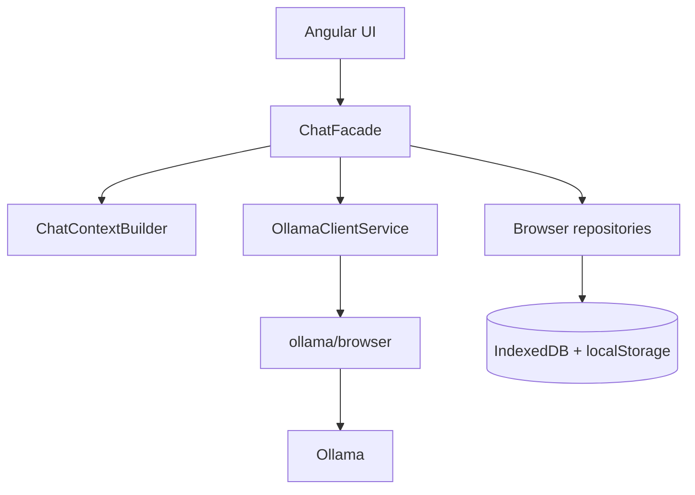

# LocalNook

[](docs/releases/release-0.3-local-experience/README.md)


[](LICENSE)

**LocalNook**, with the extended product name **LocalNook AI**, is a lightweight Angular client for browser-local conversation management with models served by a configured Ollama runtime. It has no application backend: the browser owns the conversation UI and storage, while the official `ollama/browser` client communicates directly with Ollama.


_The screenshot uses deterministic fixture content. See the [complete privacy-safe gallery](docs/screenshots/README.md) for desktop, mobile, model-selection, system-prompt, and rich-response views._

## What LocalNook implements

- Discovers chat-eligible Ollama models while remaining compatible with older model-list responses, and streams assistant content with optional thinking, cancellation, regeneration, and copy controls.
- Persists and reopens conversations in IndexedDB, including their selected model and thinking state, with confirmed deletion for one or all conversations.
- Manages custom prompt folders, activation, import/export, and a protected built-in rich-response prompt.
- Renders Markdown, highlighted code, KaTeX, Mermaid, and a validated, bounded Vega-Lite subset with an accessible data-table view.
- Builds intentional Ollama context from active prompts and the current conversation without sending UI identifiers, timestamps, durations, or storage metadata.

Browser-local storage is scoped to the exact application origin and is not encrypted by LocalNook. Requests are processed by the configured Ollama endpoint, which may be local, on a trusted LAN, or remote. Read the [privacy and storage boundaries](docs/user-guide.md#privacy-and-storage-boundaries) before sending sensitive content.

## Quick start

LocalNook does not install Ollama or download models automatically. The [user guide](docs/user-guide.md) covers endpoint overrides, browser-origin configuration, shutdown, and troubleshooting.

### Existing Ollama installation

Prerequisites: Node.js 22, npm, a running Ollama installation, and at least one chat-capable model.

```bash
ollama list
ollama pull <model-name>
npm ci
npm start
```

Open `http://localhost:4200`; LocalNook uses `http://localhost:11434` by default. To serve the production application through Docker while keeping Ollama on the host, run `docker compose up --build` and open `http://127.0.0.1:4201`.

### Optional containerized Ollama

With Docker Engine and Docker Compose, start both services by naming both files:

```bash
docker compose -f docker-compose.yaml -f docker-compose.ollama.yml up --build
```

After Ollama is healthy, pull a model from another terminal:

```bash
docker compose -f docker-compose.yaml -f docker-compose.ollama.yml exec ollama ollama pull <model-name>
```

Open `http://127.0.0.1:4201/?ollamaHost=http%3A%2F%2F127.0.0.1%3A11435`. Downloaded models remain in the named volume until you intentionally remove it; the full shutdown and reset commands are in the [user guide](docs/user-guide.md#optional-ollama-container).

## Architecture



Components render state and emit typed actions. `ChatFacade` owns application orchestration, `ChatContextBuilder` creates the exact model context, `OllamaClientService` contains SDK and wire mapping, and repositories own browser persistence. See the [architecture guide](docs/architecture.md), [storage and context contract](docs/storage-and-context.md), and [Ollama integration guide](docs/ollama-integration.md).

## Verification

Install from the checked lockfile and run the relevant checks:

```bash
npm ci
npm run build
npm test -- --watch=false --browsers=ChromeHeadless
npx playwright install chromium
npm run screenshots
docker compose config --quiet
docker compose -f docker-compose.yaml -f docker-compose.ollama.yml config --quiet
```

The automated suites use controlled fakes; a live Ollama smoke test is still needed for real model discovery, streaming, cancellation, and browser-origin behavior. Browser requirements and the screenshot workflow's matching Docker fallback are documented in the [testing guide](docs/testing.md).

## Documentation and releases

- [User guide](docs/user-guide.md) — setup, daily use, privacy, deletion, and troubleshooting.
- [Documentation index](docs/README.md) — architecture, storage, Ollama integration, development, and testing.
- [Screenshot gallery](docs/screenshots/README.md) — five deterministic, privacy-safe product views.
- Release notes: [0.1 MVP](docs/releases/release-0.1-mvp/README.md), [0.2 Professional refactor](docs/releases/release-0.2-professional-refactor/README.md), and [0.3 Local experience](docs/releases/release-0.3-local-experience/README.md).

## Project identity

| Property | Canonical value |
| --- | --- |
| Product | `LocalNook` / `LocalNook AI` |
| Repository / package | `localnook-ai` / `@localnook/app` (`0.1.0`) |
| Angular / Compose project | `localnook-ai` / `localnook` |
| Application image | `localnook-angular-app:0.3` |
| Story prefix | `LAC-` |
| Developer | Keresztes Zsolt — [kereszteszsolt.hu](https://kereszteszsolt.hu/) |

Product labels come from [`BrandConfig`](src/app/core/config/brand.config.ts); storage and technical identifiers remain brand-independent. Release 0.3 is a repository milestone, not a published npm package or Git tag.

## AI-assisted engineering

Optional development roles — [`architect`](.codex/agents/architect.toml), [`implementation_worker`](.codex/agents/implementation-worker.toml), [`reviewer`](.codex/agents/reviewer.toml), and [`design_reviewer`](.codex/agents/design-reviewer.toml) — are supported by [`angular-feature-delivery`](.agents/skills/angular-feature-delivery/SKILL.md), [`conversation-context`](.agents/skills/conversation-context/SKILL.md), [`ollama-integration`](.agents/skills/ollama-integration/SKILL.md), [`release-evidence`](.agents/skills/release-evidence/SKILL.md), and [`ui-design`](.agents/skills/ui-design/SKILL.md). These development aids are not LocalNook runtime dependencies; see the [Codex setup](.codex/README.md) and [working agreements](AGENTS.md).

## License

Apache License 2.0. See [`LICENSE`](LICENSE).

## Contact

**Project maintainer: Keresztes Zsolt**

| Platform | Link |
| --- | --- |
| Website | [kereszteszsolt.hu](https://kereszteszsolt.hu/) |
| GitHub | [@kereszteszsolt](https://github.com/kereszteszsolt) |

> The website is available in multiple languages: Hungarian (HU), English (EN), Romanian (RO), and German (DE).

## ☕ Ways to support

**Explore ways to support the maintainer and their projects.**

[https://kereszteszsolt.hu/en/ways-to-support/](https://kereszteszsolt.hu/en/ways-to-support/)

<p align="center">
  <a href="https://buymeacoffee.com/kereszteszsolt"></a><br>
  <strong>Every coffee counts! ☕❤️</strong>
</p>

---

<p align="center">
  <strong>Made with ❤️ by <a href="https://kereszteszsolt.hu/">Keresztes Zsolt</a></strong><br>
  ⭐ Star this repository if you found it helpful!
</p>
