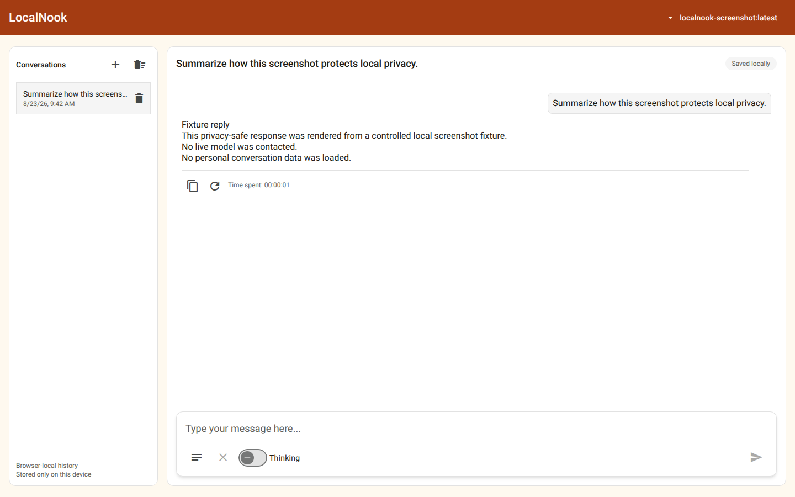
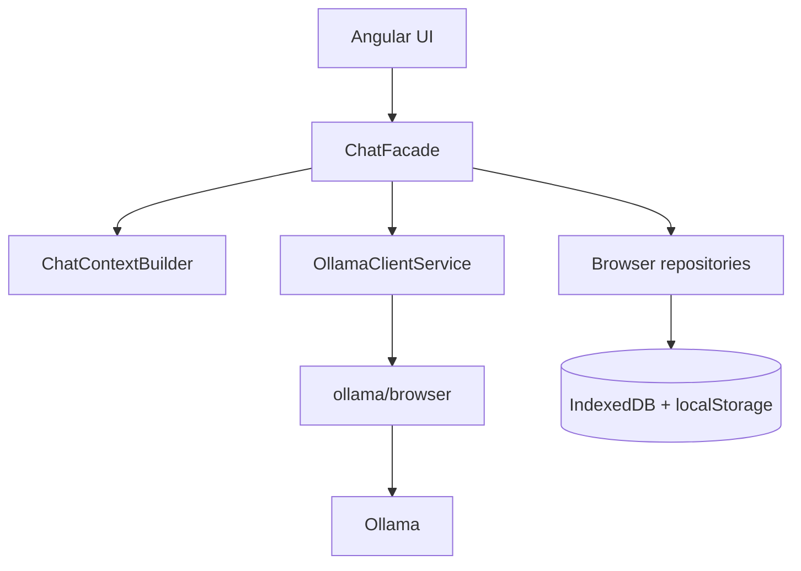

# LocalNook

[](docs/releases/release-0.3-local-experience/README.md)


[](LICENSE)

**LocalNook**, with the extended product name **LocalNook AI**, is a lightweight Angular client for private, browser-local conversations with models served by a configured Ollama runtime. It has no application backend: the browser owns the conversation UI and storage, while the official `ollama/browser` client communicates directly with Ollama.



_The screenshot uses deterministic fixture content. See the [complete privacy-safe gallery](docs/screenshots/README.md) for desktop, mobile, model-selection, system-prompt, and rich-response views._

## What LocalNook implements

- Discovers completion-capable Ollama models, remembers the selected model, and restores conversation-specific model and thinking settings.
- Streams assistant content and optional model thinking, with Stop, regenerate, copy, clear-input, and New chat controls.
- Persists conversations and prompts in separate, brand-independent IndexedDB databases; the active-model fallback uses a brand-independent localStorage key.
- Reopens saved conversations and provides confirmed permanent deletion for one conversation or all conversations. New chat does not delete history.
- Manages custom prompt folders, activation, CSV/JSON import, JSON export, and a protected built-in rich-response prompt. Custom prompt and folder deletion is immediate.
- Renders Markdown, highlighted code, KaTeX, Mermaid, and a validated, bounded Vega-Lite subset with an accessible data-table view.
- Builds intentional Ollama context from active prompts and the current conversation without sending UI identifiers, timestamps, durations, or storage metadata.

Browser-local storage is scoped to the exact application origin and is not encrypted by LocalNook. Requests are processed by the configured Ollama endpoint, which may be local, on a trusted LAN, or remote. Read the [privacy and storage boundaries](docs/user-guide.md#privacy-and-storage-boundaries) before sending sensitive content.

## Quick start

LocalNook does not install Ollama or download models automatically. Choose one of the following modes; the [user guide](docs/user-guide.md) covers endpoint overrides, origin configuration, shutdown, and troubleshooting.

### Existing Ollama installation

Prerequisites: Node.js 22, npm, a running Ollama installation, and at least one chat-capable model.

```bash
ollama list
ollama pull <model-name>
npm ci
npm start
```

Open `http://localhost:4200`. LocalNook uses `http://localhost:11434` by default. If the browser reports an origin error, configure Ollama's `OLLAMA_ORIGINS` for the exact LocalNook page origin and restart Ollama.

To serve the production application through Docker while keeping Ollama on the host, run `docker compose up --build` and open `http://127.0.0.1:4201`.

### Optional containerized Ollama

Prerequisite: Docker Engine with Docker Compose. Name both Compose files so the opt-in Ollama service is included:

```bash
docker compose \
  -f docker-compose.yaml \
  -f docker-compose.ollama.yml \
  up --build
```

After Ollama is healthy, pull a model from another terminal:

```bash
docker compose \
  -f docker-compose.yaml \
  -f docker-compose.ollama.yml \
  exec ollama ollama pull <model-name>
```

Open:

```text
http://127.0.0.1:4201/?ollamaHost=http%3A%2F%2F127.0.0.1%3A11435
```

Normal shutdown preserves downloaded models:

```bash
docker compose \
  -f docker-compose.yaml \
  -f docker-compose.ollama.yml \
  down
```

Do not add `--volumes` unless you intentionally want to delete the `ollama-models` volume and its downloaded models.

## Architecture



Components render state and emit typed actions. `ChatFacade` owns application orchestration, `ChatContextBuilder` creates the exact model context, `OllamaClientService` contains SDK and wire mapping, and repositories own browser persistence. See the [architecture guide](docs/architecture.md), [storage and context contract](docs/storage-and-context.md), and [Ollama integration guide](docs/ollama-integration.md).

## Verification

Install from the checked lockfile, then run the required build and unit suite:

```bash
npm ci
npm run build
npm test -- --watch=false --browsers=ChromeHeadless
```

Generate the five deterministic screenshots with the pinned Playwright version and browser:

```bash
npx playwright install chromium
npm run screenshots
```

Validate the base and optional Ollama Compose configurations:

```bash
docker compose config --quiet
docker compose -f docker-compose.yaml -f docker-compose.ollama.yml config --quiet
```

A Chrome or Chromium executable discoverable by Karma is required for the ChromeHeadless suite, and Playwright Chromium must match the checked `@playwright/test` version. Unit tests and deterministic screenshots use controlled fakes and do not require a live Ollama model; real model discovery, streaming, cancellation, and browser-origin behavior remain manual smoke-test boundaries. If host Node or Chromium is unavailable, use the pinned Docker fallback in the [testing guide](docs/testing.md#matching-docker-fallback). Current Release 0.3 results and exact limitations are recorded in the [LAC-030 story](docs/releases/release-0.3-local-experience/stories/LAC-030-readme-and-release-presentation.md).

## Documentation and releases

- [User guide](docs/user-guide.md) — setup, daily use, privacy, deletion, and troubleshooting.
- [Documentation index](docs/README.md) — all user and engineering guides.
- [Architecture](docs/architecture.md) — current application and persistence boundaries.
- [Testing](docs/testing.md) — required checks, deterministic screenshots, and environment fallbacks.
- [Screenshot gallery](docs/screenshots/README.md) — five approved privacy-safe product views.
- [Release 0.1 — MVP](docs/releases/release-0.1-mvp/README.md) — seven implemented foundation stories.
- [Release 0.2 — Professional refactor](docs/releases/release-0.2-professional-refactor/README.md) — sixteen implemented architecture and product-hardening stories.
- [Release 0.3 — Local experience](docs/releases/release-0.3-local-experience/README.md) — seven implemented startup, packaging, evidence, documentation, and presentation stories.

## Project identity

| Property | Canonical value |
| --- | --- |
| Display name | `LocalNook` |
| Extended product name | `LocalNook AI` |
| Repository identity | `localnook-ai` |
| Private npm package | `@localnook/app` (`0.1.0`) |
| Angular application | `localnook-ai` |
| Docker Compose project | `localnook` |
| Application image | `localnook-angular-app:0.3` |
| Story prefix | `LAC-` |
| Model provider/runtime | Ollama |
| Developer | Keresztes Zsolt — [kereszteszsolt.hu](https://kereszteszsolt.hu/) |
| License | Apache-2.0 |

Product labels come from the typed [`BrandConfig`](src/app/core/config/brand.config.ts). Storage identifiers, package names, the Angular application, Docker identities, and the `LAC-` story prefix remain stable technical contracts rather than derivatives of the display name.

Release 0.3 is a repository delivery milestone; it does not claim a published `0.3.0` npm package or Git tag.

## AI-assisted engineering

The repository includes four focused, optional Codex agent roles:

- [`architect`](.codex/agents/architect.toml) — plans boundary and cross-cutting changes.
- [`implementation_worker`](.codex/agents/implementation-worker.toml) — owns one bounded implementation.
- [`reviewer`](.codex/agents/reviewer.toml) — checks correctness, regression risk, privacy, and evidence.
- [`design_reviewer`](.codex/agents/design-reviewer.toml) — reviews user-visible behavior, tokens, accessibility, and Penpot alignment.

Five repository skills keep recurring work scoped:

- [`angular-feature-delivery`](.agents/skills/angular-feature-delivery/SKILL.md)
- [`conversation-context`](.agents/skills/conversation-context/SKILL.md)
- [`ollama-integration`](.agents/skills/ollama-integration/SKILL.md)
- [`release-evidence`](.agents/skills/release-evidence/SKILL.md)
- [`ui-design`](.agents/skills/ui-design/SKILL.md)

These files define development workflows; they are not runtime dependencies or an agent framework embedded in LocalNook. See the [Codex project setup](.codex/README.md) and repository [working agreements](AGENTS.md).

## Contact

**Project maintainer: Keresztes Zsolt**

| Platform | Link |
| --- | --- |
| Website | [kereszteszsolt.hu](https://kereszteszsolt.hu/) |
| GitHub | [@kereszteszsolt](https://github.com/kereszteszsolt) |

## ☕ Ways to support

[https://kereszteszsolt.hu/en/ways-to-support/](https://kereszteszsolt.hu/en/ways-to-support/)

[Buy Me a Coffee](https://buymeacoffee.com/kereszteszsolt)

## License

LocalNook is licensed under the [Apache License 2.0](LICENSE). The repository applies short SPDX headers only to new hand-authored source or configuration files that support comments; see the [licensing guide](docs/licensing.md).
