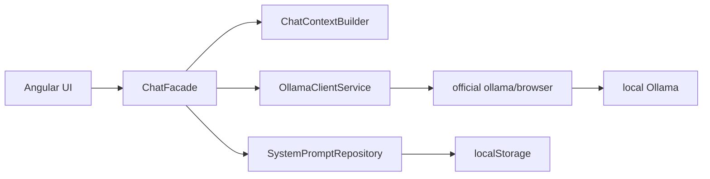

# LocalNook

**LocalNook**, with the extended product name **LocalNook AI**, is a lightweight Angular client in the `localnook-ai` repository for private conversations with models served by Ollama on the user's machine.

This repository keeps the supplied MVP features, replaces the improvised transport path with the official Ollama browser client, introduces typed application boundaries and central branding, and documents the remaining professional refactor as bounded user stories.

## Current capabilities

- Discover and select locally available Ollama models.
- Stream chat responses and optional model thinking through `ollama/browser`.
- Stop generation, start a new chat, regenerate a response, and copy answers.
- Build deterministic model context from active system prompts and the current in-memory conversation.
- Render Markdown, highlighted code, Mermaid diagrams, and KaTeX formulas.
- Manage browser-local system prompts with CSV/JSON import and JSON export.
- Configure user-visible product identity through a typed `BrandConfig`.

Conversation history is currently in memory. IndexedDB persistence plus reopen/delete UI is planned in Release 0.2.

## Architecture



See [`docs/architecture.md`](docs/architecture.md) for current and planned boundaries.

## Local development

Prerequisites: Node.js 22, npm, and a running local Ollama instance.

```bash
npm ci
npm start
```

Open `http://localhost:4200`. The default Ollama endpoint is `http://localhost:11434`.

## Docker development

```bash
docker compose up --build
```

Open `http://localhost:4201`.

## Verification

```bash
npm run build
npm test -- --watch=false --browsers=ChromeHeadless
```

Unit tests use application-owned fakes at the Ollama boundary, so a live Ollama server is not required for the required suite. A local smoke test still verifies real model discovery and streaming.

## Project map

- [`AGENTS.md`](AGENTS.md) — repository working agreements.
- [`docs/README.md`](docs/README.md) — documentation index.
- [`docs/releases/release-0.1-mvp/`](docs/releases/release-0.1-mvp/) — supplied MVP stories, all implemented.
- [`docs/releases/release-0.2-professional-refactor/`](docs/releases/release-0.2-professional-refactor/) — implemented and planned refactor stories.
- [`.codex/README.md`](.codex/README.md) — four custom agents and optional Penpot MCP.
- [`.agents/skills/`](.agents/skills/) — five focused repository skills.

## Branding and ownership

Change display metadata in `src/app/core/config/brand.config.ts`. The canonical technical identities are repository `localnook-ai`, package `@localnook/app`, Angular application `localnook-ai`, and Docker Compose project `localnook`. The provider name and browser-storage identifiers remain separate.

Developer: **Keresztes Zsolt** — `https://kereszteszsolt.hu`

## License

Apache License 2.0. The full text is in [`LICENSE`](LICENSE). In this cleanup phase, short SPDX headers are applied only to newly added hand-authored files that support comments.
