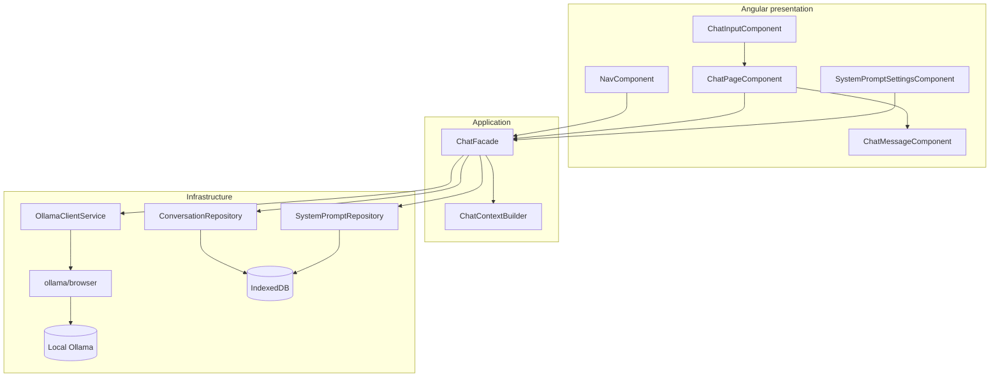
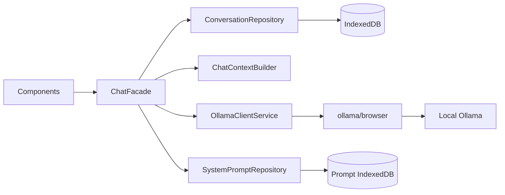

# Architecture

## Goals

LocalNook should remain a small browser application with explicit responsibilities:

- Angular components render state and emit typed user actions.
- `ChatFacade` owns chat/application state and use-case orchestration.
- `ChatContextBuilder` creates the exact model request context.
- `OllamaClientService` adapts the official browser SDK.
- Repositories own browser storage and validation.
- Product branding and Ollama runtime configuration remain separate.

## Current baseline



Conversation messages and system prompts use separate, versioned, brand-independent IndexedDB databases through their respective repositories. `SystemPromptRepository` performs a one-time migration from the former localStorage keys only after its IndexedDB transaction succeeds.

## Release 0.2 target



The conversation IndexedDB design stays intentionally small:

- one database with an explicit schema version;
- conversations and messages owned by one repository boundary;
- stable technical identifiers;
- reopen, delete-one, and delete-all operations;
- migration logic only when the schema actually changes.

## Dependency rules

```text
components -> application -> infrastructure -> external SDK/browser API
```

- Components do not call the SDK, localStorage, or IndexedDB directly.
- Infrastructure does not own user-interface state.
- Storage records are not reused as Ollama request DTOs.
- BrandConfig does not contain runtime hosts, secrets, or storage names.
- New abstractions require a concrete responsibility and test seam.
