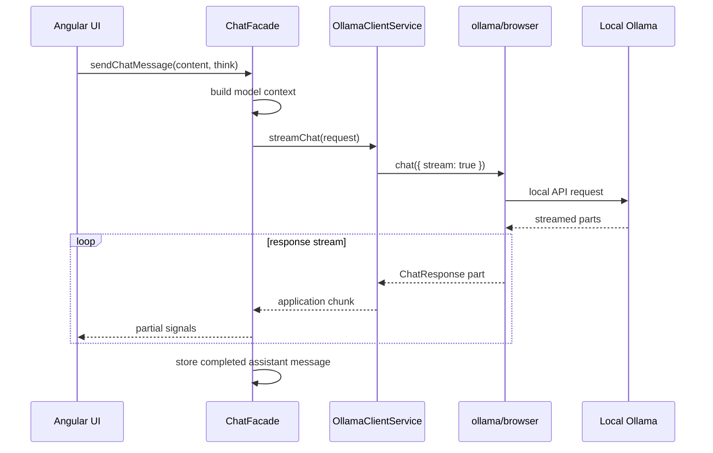

# Ollama integration

## Current contract

Browser communication uses the official `ollama` package through the `ollama/browser` entry point.



## Boundary responsibilities

`OllamaClientService`:

- lists available models;
- maps application messages to SDK messages;
- starts streamed chat requests;
- maps content, thinking output, completion state, and duration;
- tracks one active stream and cancels it through the dedicated SDK client.

`ChatFacade`:

- validates that a model is selected;
- owns loading, partial response, partial thinking, and error signals;
- appends the user message only when a request can start;
- stores a completed assistant message after a successful non-empty stream;
- prevents regeneration from duplicating the original user message;
- clears partial state after completion, failure, or cancellation.

## Runtime configuration

`src/app/core/config/ollama.config.ts` owns the injectable browser-runtime host. It is intentionally separate from product branding and browser-storage identifiers.

The safe default is `http://localhost:11434`. Override it for the current page load with the `ollamaHost` query parameter:

```text
http://localhost:4200/?ollamaHost=http%3A%2F%2F127.0.0.1%3A11435
```

The override must be an absolute `http` or `https` origin. Credentials, paths, query strings, and fragments are rejected, and accepted values are normalized to their URL origin. An invalid explicit override produces recoverable guidance before an SDK client is created.

For browser access, the Ollama installation must permit the LocalNook page origin. Configure `OLLAMA_ORIGINS` for the exact application origin, such as `http://localhost:4200` for host development or `http://localhost:4201` for the current Docker development port, then restart Ollama. A remote or LAN endpoint must also bind to a browser-reachable interface through `OLLAMA_HOST` or a correctly configured proxy; expose it only on a trusted network. The [official Ollama FAQ](https://docs.ollama.com/faq) documents host binding, additional origins, and platform-specific environment configuration.

A browser reports offline, unreachable-host, and blocked-origin failures through similar fetch errors. LocalNook therefore shows one actionable message: start Ollama, confirm the configured endpoint, and check `OLLAMA_ORIGINS`. Specific SDK errors such as a missing model remain unchanged.

## Existing-host startup

Confirm that Ollama is available and that at least one completion model is installed:

```bash
ollama list
ollama pull <model-name>
```

Then start LocalNook:

```bash
npm ci
npm start
```

The [official CLI reference](https://docs.ollama.com/cli) covers model and server commands. The [official JavaScript client](https://github.com/ollama/ollama-js) documents the `ollama/browser` entry point, custom host, async streaming, and abort behavior used by the adapter.

## WSL boundary

On the implementation workstation, WSL2 reached the Ollama API at `http://localhost:11434`; an origin probe for `http://localhost:4201` received an allow-origin response, and a direct completion request succeeded. The Ollama CLI was not available on the tested WSL or Windows command paths, so the documented CLI workflow is based on the official CLI contract rather than a local CLI run.

This result is specific to that workstation and does not establish a universal hostname across WSL networking modes. Do not assume a gateway: configure `ollamaHost` with an origin the target browser can reach and set `OLLAMA_ORIGINS` for the page origin.

## Testing

The SDK is injected through `OLLAMA_BROWSER_CLIENT_FACTORY`, allowing unit tests to provide a fake client and fake async stream. Required unit tests do not depend on a running Ollama server.
