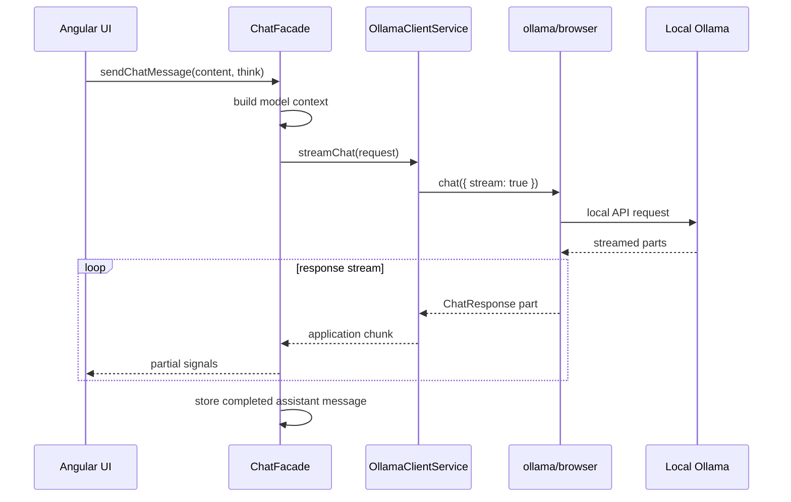

# Ollama integration

## Current contract

Browser communication uses the official `ollama` package through the `ollama/browser` entry point.

## Boundary responsibilities

`OllamaClientService`:

- lists available models;
- maps application messages to SDK messages;
- starts streamed chat requests;
- maps content, thinking output, completion state, and duration;
- tracks one active stream and cancels it through the dedicated SDK client.

`ChatFacade`:

- validates that a model is selected;
- owns loading, partial response, partial thinking, and error signals;
- appends the user message only when a request can start;
- stores a completed assistant message after a successful non-empty stream;
- prevents regeneration from duplicating the original user message;
- clears partial state after completion, failure, or cancellation.

## Runtime configuration

`src/app/core/config/ollama.config.ts` contains a small injectable host config. It is intentionally separate from product branding.

For browser access, the local Ollama installation must permit the application's origin. This is an environment concern, not a reason to reintroduce a custom transport layer.

## Testing

The SDK is injected through `OLLAMA_BROWSER_CLIENT_FACTORY`, allowing unit tests to provide a fake client and fake async stream. Required unit tests do not depend on a running Ollama server.
