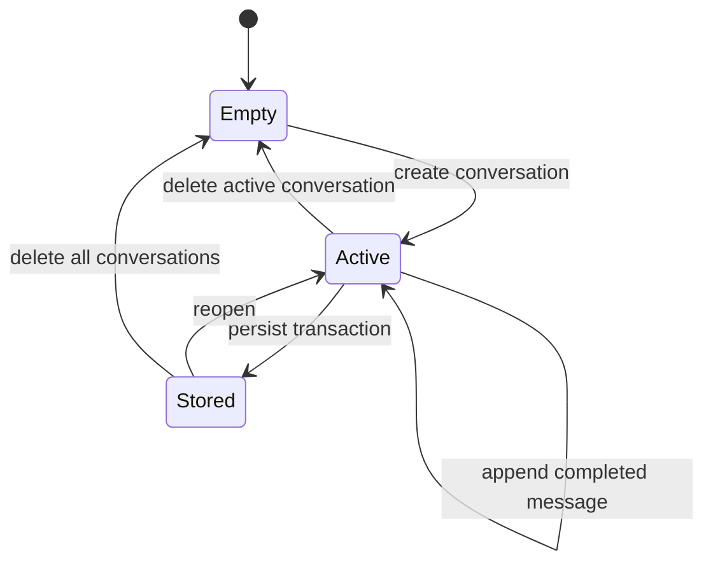

# Storage and context

## Current state

- Conversation messages are stored in IndexedDB through `ConversationRepository` and the active conversation is restored on reload.
- Each saved conversation stores its selected Ollama model identifier and thinking-toggle state in the same IndexedDB record.
- System prompts are stored through `SystemPromptRepository` in the dedicated, brand-independent `local-ai-client.system-prompts` IndexedDB database.
- The last active model identifier is stored in localStorage through `ActiveModelRepository` when no available conversation model takes precedence.
- A canonical LocalNook rich-response prompt is seeded active by default. Its activation may change, but its instructions cannot be edited, deleted, or replaced by an import.
- Custom prompts retain folders, CRUD, import/export, and permanent deletion. The built-in prompt is not in a custom folder and is therefore unaffected by folder deletion.
- The former `local-ai-client.system-prompts.v1` key is read once, falling back to `ollama-chat-system-prompts`; valid prompts retain their active state and order. Source keys are removed only after the IndexedDB transaction succeeds.
- Prompt records have explicit positions: an active built-in prompt is first, followed by active custom prompts in stored order.
- The database name, keys, and stable IDs are deliberately independent of the display brand.

## Model context

`ChatContextBuilder` produces a new model request array for every generation:

1. active, non-empty system prompts, with the built-in prompt first when active;
2. non-empty user and assistant messages from the current in-memory chat.

Only `role` and `content` are copied. Request IDs, response references, durations, thinking toggles, editing state, folder metadata, and persistence metadata stay inside the application.

Regeneration truncates history after the selected original user message, then generates a replacement assistant message without adding the same user message again.

## IndexedDB scope

Release 0.2 provides browser-local conversation persistence with:

- stable conversation IDs and timestamps;
- an optional model identifier and thinking-toggle state for backward-compatible conversation selection;
- messages linked to one conversation;
- explicit schema versioning;
- list/open/create/update operations;
- delete-one and delete-all operations;
- active-conversation recovery after reload;
- visible, recoverable storage errors.

The repository must not derive database names or record IDs from `BrandConfig.productName`.

## Deletion behavior

Deletion is part of the persistence contract, not an optional cleanup detail. Removing a conversation must remove its messages and clear any active reference. Delete-all must leave the application in a valid empty state.
