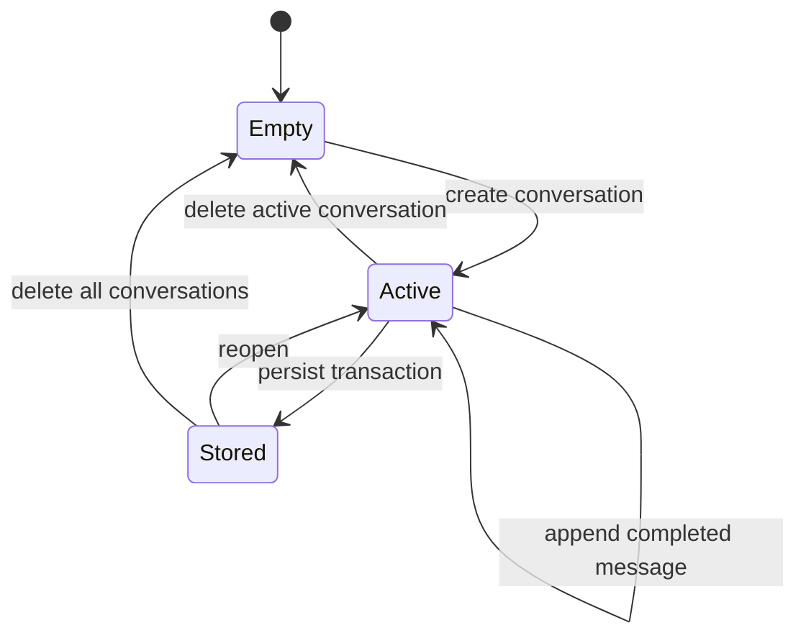

# Storage and context

## Current state

- Conversation messages are stored in the brand-independent `local-ai-client.conversations` IndexedDB database through `ConversationRepository`, and the active conversation is restored on reload.
- Each saved conversation stores its selected Ollama model identifier and thinking-toggle state in the same IndexedDB record.
- System prompts are stored through `SystemPromptRepository` in the dedicated, brand-independent `local-ai-client.system-prompts` IndexedDB database.
- The last active model identifier is stored in localStorage under `local-ai-client.active-model.v1` through `ActiveModelRepository` when no available conversation model takes precedence.
- A canonical LocalNook rich-response prompt is seeded active by default. Its activation may change, but its instructions cannot be edited, deleted, or replaced by an import.
- Custom prompts retain folders, CRUD, import/export, and permanent deletion. The built-in prompt is not in a custom folder and is therefore unaffected by folder deletion.
- The former `local-ai-client.system-prompts.v1` key is read once, falling back to `ollama-chat-system-prompts`; valid prompts retain their active state and order. Source keys are removed only after the IndexedDB transaction succeeds.
- Prompt records have explicit positions: an active built-in prompt is first, followed by active custom prompts in stored order.
- The database name, keys, and stable IDs are deliberately independent of the display brand.
- Browser storage is scoped to the exact application origin, including scheme, host, and port. Opening LocalNook at another origin uses a separate localStorage and IndexedDB area.

## Model context

`ChatContextBuilder` produces a new model request array for every generation:

1. active, non-empty system prompts, with the built-in prompt first when active;
2. non-empty user and assistant messages from the active conversation held by `ChatFacade`, including a conversation restored from storage.

Only `role` and `content` are copied. Request IDs, response references, durations, thinking toggles, editing state, folder metadata, and persistence metadata stay inside the application.

Regeneration truncates history after the selected original user message, then generates a replacement assistant message without adding the same user message again.

The context boundary minimizes application metadata, not the location of model processing. Requests go to the configured Ollama endpoint; a LAN, remote, proxied, or cloud-backed runtime may process content away from the LocalNook machine. Model-generated Markdown may also reference external links or remote media.

## IndexedDB scope

The current implementation provides browser-local conversation persistence with:

- stable conversation IDs and timestamps;
- an optional model identifier and thinking-toggle state for backward-compatible conversation selection;
- messages linked to one conversation;
- explicit schema versioning;
- list/open/create/update operations;
- delete-one and delete-all operations;
- active-conversation recovery after reload;
- visible, recoverable storage errors.

The repository must not derive database names or record IDs from `BrandConfig.productName`.

## Deletion behavior

Deletion is part of the persistence contract, not an optional cleanup detail. The UI asks for confirmation before deleting one conversation or all conversations. Removing an active conversation removes its messages and clears the active reference; delete-all leaves the application in a valid empty state.

New chat is not deletion: it clears the visible chat and active reference while keeping the saved conversation available to reopen. Custom system-prompt removal and custom-folder deletion are different: they persist immediately without confirmation, and folder deletion removes every custom prompt in that folder. The protected built-in prompt cannot be deleted and is not part of a custom folder.

Browser site-data tools can erase the current origin's LocalNook data outside these in-app flows and confirmation dialogs. Deleting browser data does not remove models managed by Ollama.
