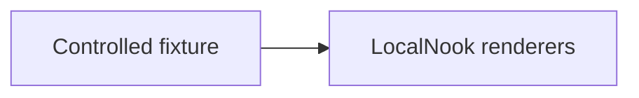

# LocalNook user guide

LocalNook is a browser application for conversations with an Ollama runtime. Conversations and prompts are stored in the current browser profile; Ollama remains a separate service that you install, start, and manage yourself.

See the [product screenshot gallery](screenshots/README.md) for the desktop, mobile, model-selection, prompt-management, and rich-response views described below.

## Start LocalNook

### Existing Ollama on the host

Prerequisites are Node.js 22, npm, a running Ollama installation, and at least one chat-capable model. LocalNook does not install Ollama or download models from its UI.

```bash
ollama list
ollama pull <model-name>
npm ci
npm start
```

Open `http://localhost:4200`. The default Ollama endpoint is `http://localhost:11434`.

### Production application container with host Ollama

This path requires Docker Engine with Docker Compose; it does not require host Node.js or npm for the container build.

```bash
docker compose up --build
```

Open `http://127.0.0.1:4201`. This mode serves the production Angular output through Nginx while the browser still connects to the host Ollama endpoint at `http://localhost:11434`.

Stop the application with `docker compose down`.

### Optional Ollama container

Start both the production application and the opt-in Ollama service by naming both Compose files. This foreground command keeps running and shows the service logs:

```bash
docker compose -f docker-compose.yaml -f docker-compose.ollama.yml up --build
```

After the Ollama service is healthy, open another terminal in the repository and pull a model:

```bash
docker compose -f docker-compose.yaml -f docker-compose.ollama.yml exec ollama ollama pull <model-name>
```

No model is downloaded automatically. Open the application with the container's browser-reachable endpoint:

```text
http://127.0.0.1:4201/?ollamaHost=http%3A%2F%2F127.0.0.1%3A11435
```

Normal shutdown preserves models in the `ollama-models` named volume:

```bash
docker compose -f docker-compose.yaml -f docker-compose.ollama.yml down
```

The following command permanently deletes that volume and its downloaded models. Use it only for an intentional model-data reset:

```bash
docker compose -f docker-compose.yaml -f docker-compose.ollama.yml down --volumes
```

### Endpoint overrides

Use the `ollamaHost` query parameter when the browser must reach another endpoint. The value must be one absolute `http` or `https` origin with no credentials, path, query, or fragment. For example:

```text
http://localhost:4200/?ollamaHost=http%3A%2F%2F192.168.1.20%3A11434
```

An invalid override is rejected before the Ollama SDK is called. A remote endpoint must listen on a browser-reachable interface, and Ollama must allow the exact LocalNook page origin through `OLLAMA_ORIGINS` when its defaults do not already allow it.

## Discover and select models

LocalNook requests the model list when the navigation bar loads. The model menu:

- includes models advertising the `completion` capability;
- excludes models that advertise only capabilities such as `embedding`;
- retains models from older Ollama responses that do not include a capabilities list;
- enables Thinking only when the selected model explicitly advertises the `thinking` capability.

The first eligible model is selected when no saved eligible choice exists. A selection is remembered in localStorage as the general fallback and, after a conversation exists, in that conversation's IndexedDB record. Reopening a conversation restores its model when still available. If that model is unavailable, LocalNook reports the fallback and selects the first available model without silently rewriting the stored conversation model.

There is no model-refresh button. After `ollama pull <model-name>`, reload LocalNook to request the model list again.

## Chat controls

- Type in the composer and press Enter or the Send button. Use Shift+Enter for a new line.
- Clear removes only the unsent composer text.
- The user message is saved before streaming starts. A completed non-empty assistant response is saved after the stream finishes.
- Assistant content appears incrementally while Ollama streams it; the response toolbar is available after completion.
- Stop aborts the active SDK client. The already saved user message remains, while partial assistant content and partial thinking are cleared and are not stored as a completed message.
- Copy uses the browser clipboard API for the completed assistant content and reports when clipboard access fails.
- Regenerate starts again from the selected original user message. It permanently truncates the saved later branch, then stores the replacement response without duplicating that user message.
- New chat stops any active stream, clears the visible active conversation, and clears the active-conversation reference. It does not delete the previous saved conversation; reopen it from the conversation list.

### Thinking

Thinking is available only for a model with an explicit `thinking` capability. The toggle is stored per conversation. Thinking output streams separately from the final answer, can be expanded or reduced while streaming, and can be expanded or collapsed after completion. It is sent to neither future model context nor storage metadata as a user message; completed thinking output belongs to the saved assistant message.

## Browser-local conversations

The first non-empty user message becomes the conversation title, limited to its first 80 characters. The conversation panel lists saved conversations and lets you reopen them. Reloading the same application origin restores the active conversation, its messages, its saved model identifier, and its thinking-toggle state.

Delete actions are permanent:

- deleting one conversation asks for confirmation and removes its messages;
- Delete all asks for confirmation and removes every conversation;
- deleting the active conversation also clears the active reference and visible history;
- New chat is not deletion.

IndexedDB failures are shown as recoverable page errors. If saving the initial user message fails, LocalNook does not start the model request. If saving an otherwise completed assistant response fails, the response may remain visible in the current page together with the error, but it is not durable and may disappear after reload. A failed model/thinking update can likewise leave the previous durable setting in storage. Check browser storage permissions and available space, then retry the action or reload the last durable state. Avoid clearing site data unless you intend to remove browser-local conversations and prompts.

## System prompts

Open System Prompts from the notes button beside the composer.

The LocalNook default, **Rich response formats**, is seeded active and placed before custom prompts in model context. You can deactivate or reactivate it, view its instructions, and restore its canonical content. It cannot be edited, deleted, moved into a custom folder, or replaced by import data.

Custom prompts support folders, add/edit, individual activation, activate-all/inactivate-all, JSON/CSV import, and JSON export. Important deletion behavior differs from conversations:

- removing a custom prompt is immediate and has no confirmation dialog;
- deleting a custom folder immediately removes every prompt in that folder, without confirmation;
- these prompt changes are persisted immediately;
- the protected built-in prompt is outside custom folders and survives folder deletion;
- conversation deletion does require confirmation.

CSV imports require `foldername` and `prompt` columns and support quoted commas and new lines. JSON imports require an array of objects with non-empty string `folder` and `prompt` properties. Imports append valid custom prompts as active entries with new internal IDs. Export writes custom prompts as `{ "folder", "prompt" }` objects; it does not export prompt IDs, activation state, or the protected built-in prompt.

Prompt storage errors remain visible in the dialog. A failed save restores the last state successfully loaded or saved by the application rather than presenting the failed edit as durable.

## Rich responses

Assistant messages support standard Markdown, Prism-highlighted fenced code, KaTeX math, Mermaid diagrams, and a bounded subset of fenced Vega-Lite v5 charts. Rich output is model-generated content, so inspect it like any other model answer.

### Mermaid example

Use Mermaid for flows and relationships, not data plots:

````markdown

````

### Vega-Lite example

Charts must use inline `data.values`; remote data URLs and executable transforms are rejected. This example is the deterministic line chart used by the screenshot verification:

````markdown
```vega-lite
{
  "$schema": "https://vega.github.io/schema/vega-lite/v5.json",
  "title": "Deterministic sample",
  "description": "Fixed values supplied by the screenshot fixture.",
  "width": 320,
  "height": 140,
  "data": {
    "values": [
      { "x": 0, "y": 0 },
      { "x": 1, "y": 1 },
      { "x": 2, "y": 4 },
      { "x": 3, "y": 9 }
    ]
  },
  "mark": { "type": "line", "point": true },
  "encoding": {
    "x": { "field": "x", "type": "quantitative", "title": "Input" },
    "y": { "field": "y", "type": "quantitative", "title": "Output" }
  }
}
```
````

The validator limits a specification to 100,000 characters, 250 rows, 20 fields per row, short field/text values, and integer dimensions from 1 to 1200 pixels. It allowlists top-level keys, marks, encoding channels, field types, and aggregates. Unsupported or invalid chart input shows an accessible fallback with the original specification instead of executing it. A valid chart also offers its inline values as a table.

KaTeX uses `$...$` or `$$...$$`. Code highlighting loads language definitions from application assets. Mermaid and Vega-Lite blocks must be syntactically valid; otherwise the renderer may show the source or a fallback rather than the intended visual.

## Privacy and storage boundaries

Browser-local does not mean that every part of a request stays on the same machine:

- conversations are in the brand-independent `local-ai-client.conversations` IndexedDB database;
- prompts are in the separate `local-ai-client.system-prompts` IndexedDB database;
- the last active model is in localStorage under `local-ai-client.active-model.v1`;
- browser storage is scoped to the exact origin, including scheme, host, and port; opening LocalNook at a different origin produces a different storage area;
- the model receives only active non-empty system prompts followed by non-empty user and assistant messages from the current conversation, each reduced to `role` and `content`;
- UI IDs, timestamps, durations, thinking toggles, folders, and persistence metadata are not sent as model context;
- conversation delete and delete-all are the explicit in-app deletion paths; custom prompt removal/folder deletion are immediate prompt-deletion paths;
- deleting LocalNook browser data does not delete Ollama models, and New chat deletes neither conversations nor models.

To remove every LocalNook browser record for an origin, including the active-model preference, use that browser's site-data controls after exporting anything you intend to keep. Site-data clearing bypasses the application's confirmation dialogs.

Requests go to the configured Ollama endpoint. A LAN, remote, proxied, or cloud-backed Ollama runtime may process data away from the LocalNook machine. Review that runtime's privacy and retention behavior before sending sensitive content.

Markdown answers may contain external links or remote-media URLs. Opening a link—and, depending on rendered Markdown, loading remote media—can contact an external host. LocalNook does not turn arbitrary model output into a guarantee of network isolation.

Local browser storage is not encrypted by LocalNook and is accessible to someone using the same browser profile. Browser clearing tools can remove it outside the application's confirmation dialogs.

## Troubleshooting

### Ollama is offline or unreachable

Start Ollama, confirm the configured endpoint in the page URL, and check that the browser can reach it. LocalNook's connection message includes the endpoint and reminds you to check `OLLAMA_ORIGINS`. Browser CORS errors, offline state, and an unreachable host can look alike.

### No models appear

Run `ollama list`. Pull a completion model if needed, then reload the page; there is no refresh button. Embedding-only models are intentionally filtered. Older capability-less model entries remain eligible, but Thinking stays disabled without an explicit thinking capability.

### Endpoint override is rejected

Use only an absolute `http` or `https` origin. Remove credentials, paths such as `/api`, query strings, and fragments from the `ollamaHost` value.

### Browser-origin errors

Configure `OLLAMA_ORIGINS` with the exact LocalNook page origin and restart Ollama. Do not use a wildcard merely to bypass an origin error. A remote endpoint may also need `OLLAMA_HOST` or a trusted proxy to bind to a reachable interface.

### Docker mode cannot connect

The browser cannot use a Compose-only hostname such as `ollama`. Use the documented encoded `http://127.0.0.1:11435` override for the overlay. Check both services and their health with:

```bash
docker compose -f docker-compose.yaml -f docker-compose.ollama.yml ps
```

Then pull a model explicitly with the full two-file `exec` command from the startup section.

### WSL behaves differently

Do not assume one WSL gateway name works everywhere. Depending on the host and networking mode, Ollama may be reachable through `localhost`, the Windows host address, or another configured interface. Verify the endpoint from the browser that runs LocalNook.

### Conversation or prompt storage fails

Check whether site storage is blocked, unavailable, or full. Keep the error visible while diagnosing it. Reload to restore the last durable state. Clearing site data is permanent and affects only the current origin's LocalNook storage.

### Rich content falls back to source

Check the fence label and syntax. Mermaid must be a valid diagram. Vega-Lite must be valid JSON, use the v5 schema and inline `data.values`, and stay inside the documented allowlists and limits. Use the example above as a known-good baseline.

### Browser tests cannot start

The required unit suite uses Karma with `ChromeHeadless` and needs a Chrome or Chromium executable that Karma can discover:

```bash
npm test -- --watch=false --browsers=ChromeHeadless
```

The screenshot workflow uses Playwright's separately pinned Chromium build. Install it with `npx playwright install chromium`, or use the matching Docker image documented in [Testing](testing.md#matching-docker-fallback). A missing Playwright browser must fail rather than silently use a different executable.

## Further reading

- [Architecture](architecture.md)
- [Storage and context](storage-and-context.md)
- [Ollama integration](ollama-integration.md)
- [Development and Docker](development.md)
- [Testing and deterministic screenshots](testing.md)
- [Product screenshot gallery](screenshots/README.md)
- [Release 0.1 — MVP](releases/release-0.1-mvp/README.md)
- [Release 0.2 — Professional refactor](releases/release-0.2-professional-refactor/README.md)
- [Release 0.3 — Local experience](releases/release-0.3-local-experience/README.md)
